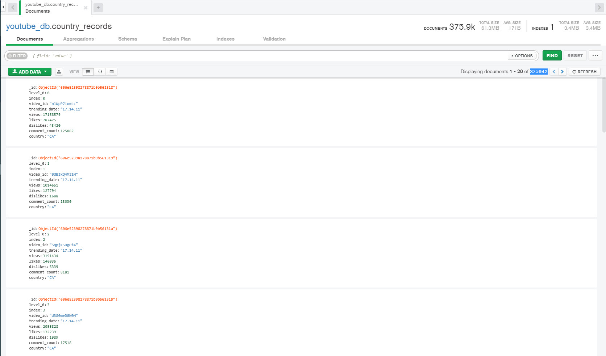
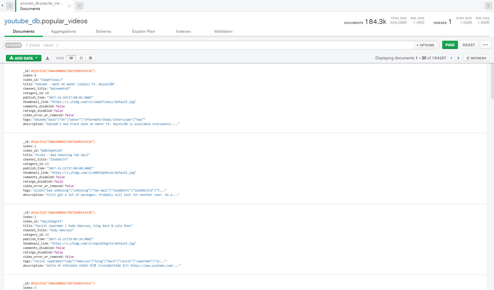

## ETL-project
Using Kaggle as a data source we are migrating 10 different csv files to a production data base. Extraction, Transformation and Load of the data was performed. 

The source of data used, and the type of transformation applied to the data to load is outlined below:

## Extract
* Data source: [Kaggle: Trending YouTube Video Statistics](https://www.kaggle.com/datasnaek/youtube-new)
* This source was selected for having well organized, updated data, that we all found relevant to include in the project.
* Use a for loop to extract data from each csv in a folder file.
* Use Jupyter notebook to create two dataframes for the ETL project.

## Transform
* Combine all dataframes from each csv file into one.
* A column with the country code was added to differentiate between countries. 
* For data cleaning the data was divided into two dataframes: Videos_df and All_Countries; to avoid redundant information. 
* Resetting the index for the videos_df and all_countries dataframes.

## Load
* Declare the database: Youtube_db
* Declare the collections: popular_videos and country_records
* Insert the dataframes in the MongoDB collections
* Convert the dataframes to dictionaries

## Features
We choose MongoDB for this ETL project because we found it very useful for extracting data through Web Scraping, meaning we can later scale the project for integrating further datasets as the data is updated.

## Content
This dataset includes several months (and counting) of data on daily trending YouTube videos. Data is included for 10 different countries (USA, Great Britain, Germany, Canada, France, Rusia, Mexico, South Korea, Japan, and India), with up to 200 listed trending videos per day.

## To do
Possible uses for this ETL project could include:

* Analyzing which videos are more popular at each country.
* Analazing which videos have more international audience.
* Training ML algorithms like RNNs to generate their own YouTube comments.
* Analysing what factors affect how popular a YouTube video will be.

## Team members
* Pilar Montes
* Erick Macias
* Jose Vazquez
* Marisela Castillo
